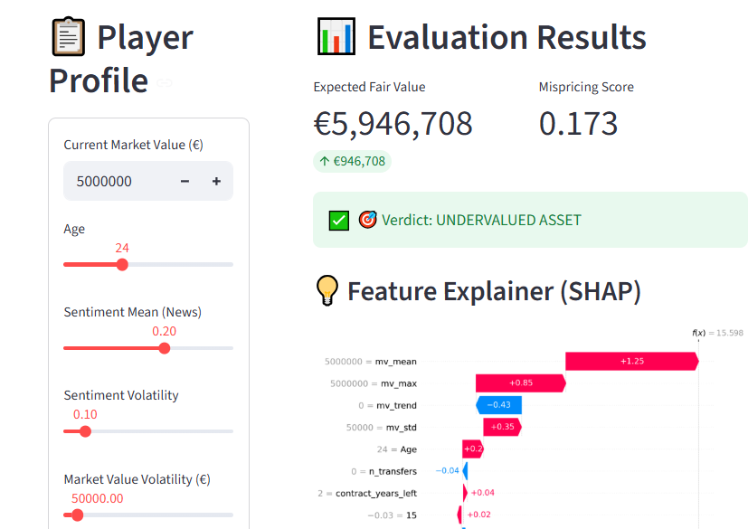

# ⚽ Football Scout AI: Undervalued Player Detection



An end-to-end machine learning application designed to identify market mispricing in the football transfer market. By combining **BERT-processed news sentiment** with historical market data, the tool estimates a "Fair Market Value" and flags potential investment opportunities.


## 🚀 Key Features
* **Hybrid Valuation Brain:** Uses a Regression model (XGBoost) for price estimation and a Classification model (TabNet) to determine undervaluation probability.
* **Sentiment Integration:** Processes news text via BERT embeddings to factor "market hype" and media sentiment into player value.
* **AI Explainability:** Integrated **SHAP waterfall plots** to show exactly which features (Age, News Sentiment, etc.) are driving the valuation.
* **Automated Scouting Reports:** Generates a downloadable PDF report for agents or scouts.

## 🛠️ Tech Stack
* **Core:** Python, Scikit-Learn, XGBoost, PyTorch (TabNet)
* **NLP:** BERT (Transformers) for text embeddings & PCA for dimensionality reduction.
* **UI:** Streamlit
* **Explainability:** SHAP (SHapley Additive exPlanations)
* **Data Handling:** Pandas, NumPy, Joblib

## 📁 Project Structure
```text
├── app/               # Streamlit UI Layer
├── models/artifacts/  # Serialized models, scalers, and feature maps
├── src/
│   ├── inference.py   # Prediction logic & feature alignment
│   ├── pipeline.py    # Math & scoring functions
│   └── explainability/# SHAP explainer logic
├── test_artifacts.py  # CI/CD integrity check script
└── requirements.txt   # Dependency manifest


